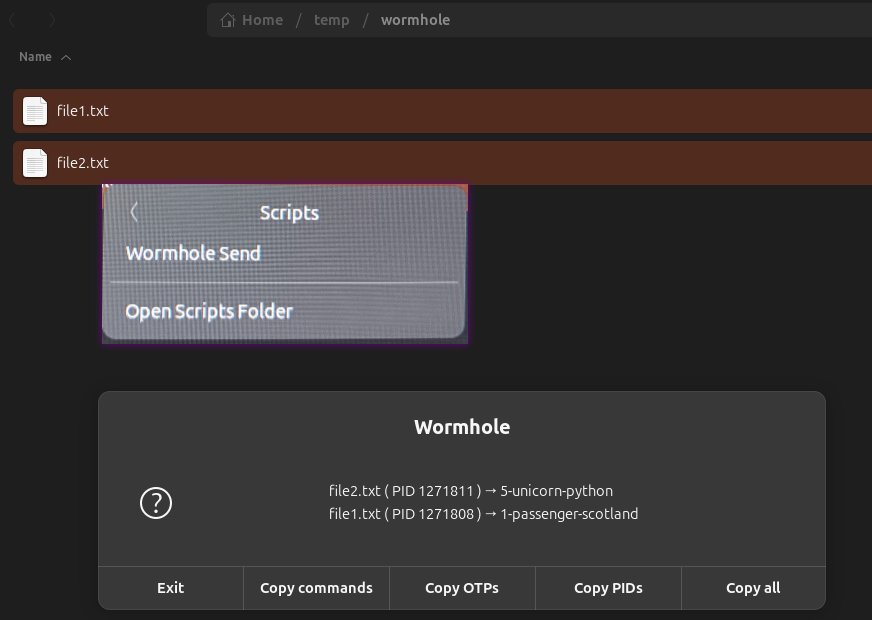

# Wormhole Scripts

This repository contains a set of bash scripts to facilitate sending and receiving files using [Magic-Wormhole](https://github.com/magic-wormhole/magic-wormhole) directly from a file manager's context menu.

## Features

-   **Parallel Transfers**: Send or receive multiple files at the same time.
-   **File Manager Integration**: Designed to be used as context menu actions in file managers like Nautilus, Caja, or Thunar.
-   **GUI Dialogs**: Uses `zenity` to provide graphical popups for easy interaction.
-   **Clipboard Integration**: Automatically detects Wormhole OTPs from the clipboard for receiving, and provides options to copy OTPs or full commands when sending.
-   **Fallback to CLI**: If `zenity` is not available, the scripts can be used from the command line.

## Scripts

-   `wormhole-send.sh`: Sends one or more selected files. It displays a dialog with the generated One-Time Passwords (OTPs) for each file and provides options to copy the OTPs or the full `wormhole receive` commands to the clipboard.
-   `wormhole-receive.sh`: Receives one or more files. It first checks the clipboard for any Wormhole OTPs. If none are found, it prompts the user to enter them.

## Installation

### Dependencies

The scripts rely on the following tools:

**Required:**
-   `magic-wormhole`: The core file transfer tool.
    ```bash
    sudo apt install magic-wormhole
    ```

**Optional (for GUI and clipboard features):**
-   `zenity`: To display graphical dialogs.
    ```bash
    sudo apt install zenity
    ```
-   `xclip`: To interact with the system clipboard.
    ```bash
    sudo apt install xclip
    ```

### File Manager Integration

To use these scripts from your file manager, you need to create symbolic links to them in the appropriate directory.

Simply run `./integrate-wormhole-to-nautilus.sh` with sudo permission, or follow the next steps :

For **Nautilus** (the default file manager in GNOME), the directory is `~/.local/share/nautilus/scripts/`.

```bash
# Navigate to your scripts directory
cd ~/.local/share/nautilus/scripts/

# Create symbolic links (replace /path/to/scripts with the actual path)
ln -s /path/to/scripts/wormhole-send.sh "Wormhole Send"
ln -s /path/to/scripts/wormhole-receive.sh "Wormhole Receive"

# Restart Nautilus
nautilus -q
```

After restarting, you should see "Wormhole Send" and "Wormhole Receive" in the context menu when you right-click on files or in the directory background.



## Usage

### Sending Files

1.  Select one or more files in your file manager.
2.  Right-click and choose "Wormhole Send".
3.  A dialog will appear showing the OTP for each file.
4.  Choose what you want to copy to the clipboard: the full commands, just the OTPs, or other information.
5.  Share the OTPs with the recipient. The transfer processes will run in the background until the files are received.

### Receiving Files

1.  Copy one or more Wormhole OTPs to your clipboard.
2.  Right-click on a folder in your file manager and choose "Wormhole Receive" (right-clicking on the background of a folder doesn't work for now).
3.  The script will automatically use the OTPs from your clipboard to start the downloads.
4.  If no OTPs are found in the clipboard, a dialog will appear asking you to paste them.
5.  The files will be downloaded to the selected directory. A notification will appear when all transfers are complete.
